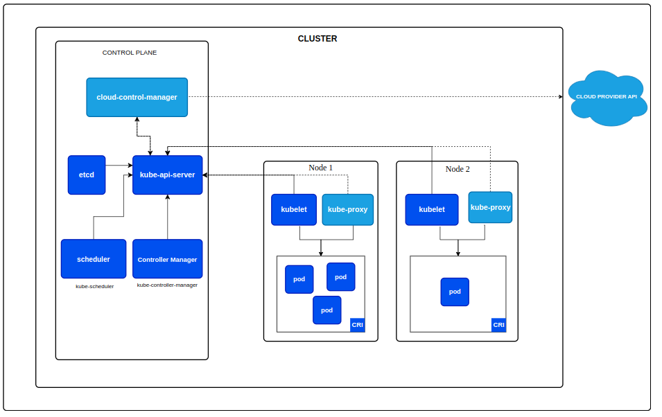
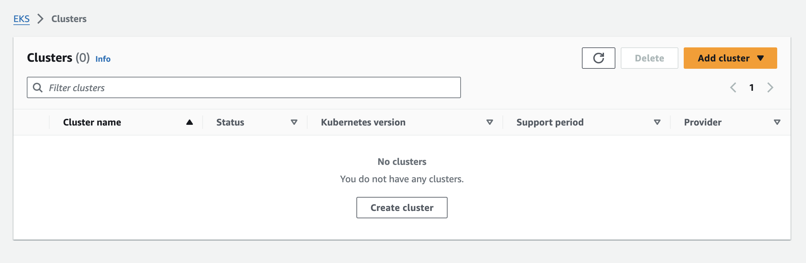
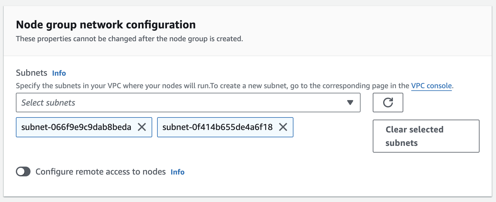
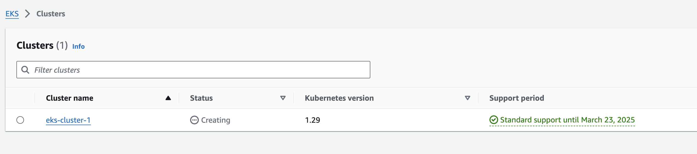
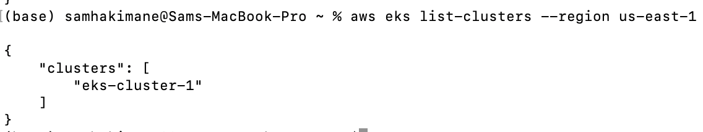
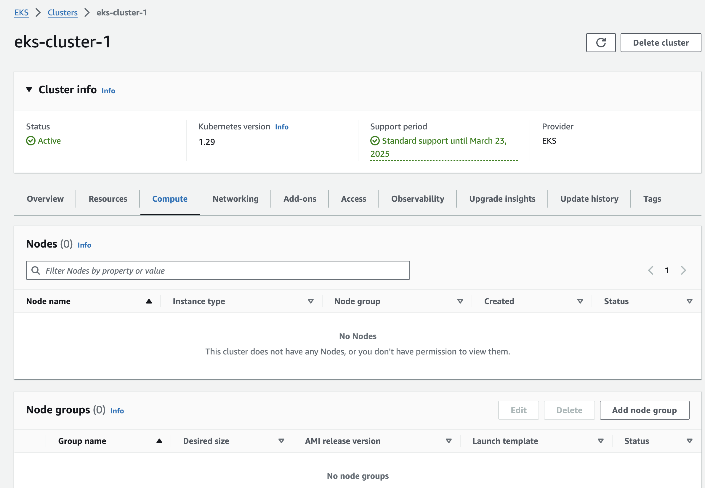
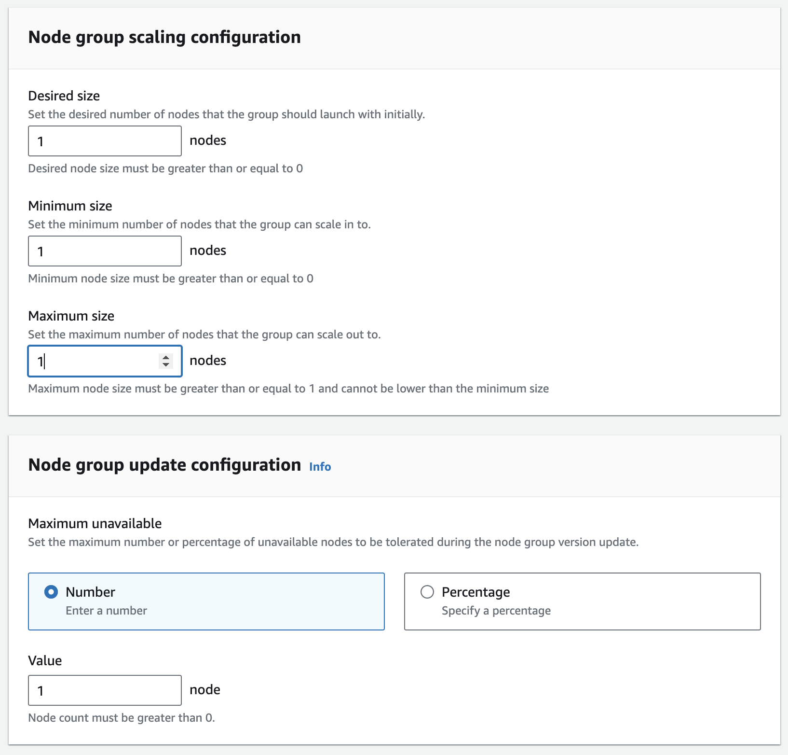
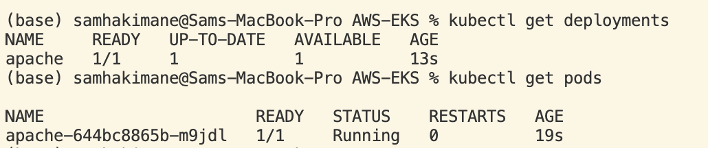
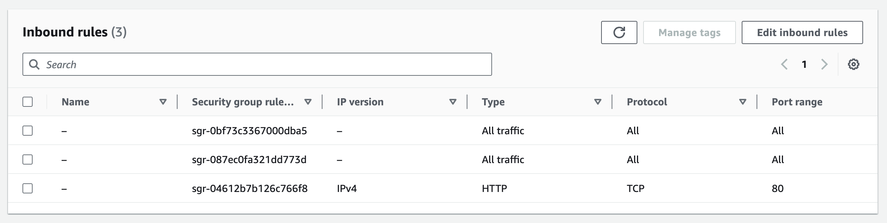
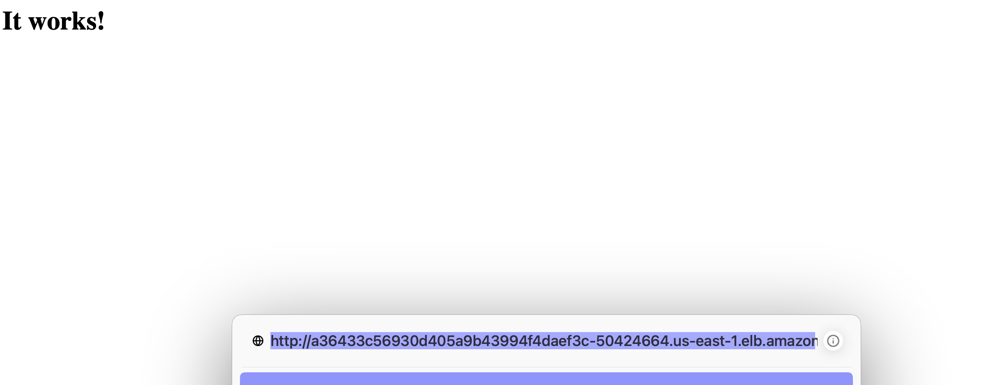

# AWS-EKS

This tutorial is aimed to learn more about Kubernetes and how to practically use it by utilizing [Amazon Elastic Kubernetes Service](https://docs.aws.amazon.com/eks/latest/userguide/what-is-eks.html). 

First, we will go through basic concepts of Docker, Kubernetes, explain a more detailed process of setting up an Amazon EKS cluster and deploying a sample application on it. 

**Pre-requisites:**
- Basic knowledge of Docker
- Basic knowledge of AWS
- `kubetcl` installed: Instructions can be found at: [Install and Set Up kubectl](https://kubernetes.io/docs/tasks/tools/install-kubectl/)

**IMPORTANT:** For this tutorial it is assumed that there is some basic knowledge about Docker and dockerized applications.
If there is no prior knowledge about Docker, it is recommended to go through the [Docker documentation](https://docs.docker.com/get-started/overview/) first.

**Helpful Links**
- [Good Youtube Channel for learning Kubernetes](https://www.youtube.com/@TechWorldwithNana)
- [Set up Kubernetes cluster in a VM using Minikube](https://minikube.sigs.k8s.io/docs/)
- [Lightweight Kubernetes k0s](https://docs.k0sproject.io/)
- [Kubernetes Documentation](https://kubernetes.io/docs/home/)
- [Amazon EKS Documentation](https://docs.aws.amazon.com/eks/latest/userguide/what-is-eks.html)
- [Docker Documentation](https://docs.docker.com/get-started/overview/)
- [Docker Compose Documentation](https://docs.docker.com/compose/)


In this tutorial, we will cover the following steps:

1. [What are containers? A Docker example](#what-are-containers-a-docker-example)
    - [What are containers used for?](#what-are-containers-used-for)
1. [What is Kubernetes?](#what-is-kubernetes)
    1. [Containers](#containers)
    2. [Pods](#pods)
    3. [Services](#services)
    4. [Deployments](#deployments)

# What are containers? A Docker example

Before going into detail about Kubernetes, it is worth mentioning what containers are and how they can be used in various applications. 
Lets start by a sample Docker container File that uses a NGINX image and exposes port 8080.

```Dockerfile
FROM nginx:latest
EXPOSE 80
```

When you would build and run this with the command

```bash
docker build -t my-nginx .
docker run -d -p 8080:80 my-nginx
```

it would create a container that runs a NGINX server and exposes it on port 8080.
We are not going into much detail about building the image, as this is a required knowledge for this tutorial.

Another way to do this is to directly run the NGINX image from Docker Hub and expose the internal port to port 8080:

```bash
docker run -d -p 8080:80 nginx:latest
```

After running this command, you can access the NGINX server by going to `http://localhost:8080` in your browser and see the default NGINX page.


## What are containers used for?

Imagine a scenario where you would not only have one container running, but multiple containers that are connected to each other.
For most known applications such as any Web application, there are usually multiple services that are running in the background such as a Frontend, Backend, Database, etc.

It is very hard to maintain a lot of numbers of Docker Containers only by using the `docker run` command.
Therefore, the need for a more sophisticated tool that can manage these containers and their communication is needed.
The `docker compose` tool is a good way to manage multiple containers.

A sample Web application with a JavaScript Frontend, Python Backend and an associated MySQL database could look like this:

```yaml
services:
  frontend:
    image: node:latest
    ports:
      - "8080:80"
    depends_on:
      - backend
  backend:
    image: python:latest
    ports:
      - "8081:80"
    depends_on:
      - database
  database:
    image: mysql:latest
    ports:
      - "3306:3306"
```

This `docker-compose.yml` file would define a Frontend, Backend and Database service that are connected to each other.
When you would run it, it would start all services and connect them to each other and you could start developing the application.

```bash
docker-compose up
```

This is a common way to manage multiple containers. 
However, this approach lacks the ability to scale and manage the containers efficiently.
When you would now think of not 3 containers that are managed but 100 containers, it will get really messy to manage and maintain all of these services that are connected to each other and still have a proper overview.
There is where Kubernetes comes into play.

# What is Kubernetes?

Kubernetes is an open-source container orchestration platform that automates the deployment, scaling, and management of containerized applications.

To give an overview, here is the basic architecture of Kubernetes:



Before going into detail about Kubernetes, lets break down some basic concepts from Kubernetes:

## Containers

As we have just seen in the [Containers Section](#what-are-containers-a-docker-example), such as those created with Docker, it package an application and its dependencies into a single, isolated unit. 
They ensure consistency across different environments, making it easier to develop, deploy, and run applications.
Containers are only implicitly used in Kubernetes, as Kubernetes is a container orchestration platform and uses Pods to manage containers.

## Pods

A pod is the smallest deployable unit in Kubernetes. 
It represents one or more containers that share networking and storage resources. 
Pods are ephemeral and can be easily created, scaled, and destroyed by Kubernetes.

As you can see in the Architecture image, Kubernetes is built around the concept of pods, which are the basic building blocks of the system.
Wthin a pod, you can have one or more containers that share resources and communicate with each other (such as the Docker containers we have seen before).

## Services

A service is an abstraction that defines a logical set of pods and a policy by which to access them.
As Pods are ephemeral, they can be created and destroyed at any time.
For this reason, it would be very hard to connect to the correct Pod directly, as it IP address could change at any time.
A Service is a way to expose a Pod to the outside world and make sure that it is always reachable.

For more information about Services consult the [Kubernetes Service Documentation](https://kubernetes.io/docs/concepts/services-networking/service/).

### Pod Example:

In Kubernetes, all resources are defined in YAML files.
These YAML files can be used to create resources in Kubernetes, such as Pods, Deployments, Services, etc.
To give an example similar to the Docker Compose example, we could define a Pod that runs a Nginx Frontend container:

```yaml
apiVersion: v1
kind: Pod
metadata:
  name: nginx-frontend
spec:
    containers:
    - name: nginx
        image: nginx:latest
        ports:
        - containerPort: 80
```

This is now very similar to the Docker Compose example, with some differences.
When you would run this Pod, it would start the Nginx container and expose it on port 80.

Before running this Pod, you would need to create it with the `kubectl` command.

```bash
kubectl apply -f nginx-frontend.yaml
```

After this command, the Pod would be created and you could access the Nginx server by going to `http://localhost:80` in your browser.

## Deployments

A Deployment is a higher-level concept that manages multiple Pods and provides a declaration that can consist of updates to the Pods, and other features.
It is a way to manage multiple Pods and make sure that they are always running and up-to-date.

An example of a Deployment that would be similar to the first shown Docker Compose example would look like this:

```yaml
apiVersion: apps/v1
kind: Deployment
metadata:
  name: my-webapp
spec:
    replicas: 3
    selector:
        matchLabels:
        app: my-webapp
    template:
        metadata:
        labels:
            app: my-webapp
        spec:
        containers:
        - name: frontend
            image: node:latest
            ports:
            - containerPort: 80
        - name: backend
            image: python:latest
            ports:
            - containerPort: 80
        - name: database
            image: mysql:latest
            ports:
            - containerPort: 3306
```

We have not yet spoken about it, but Kubernetes implements an easy way to scale up containers easily. 
Based on this Deployment manifest, it creates 3 replicas of the Web application, with a Frontend that runs a node image, a Backend with a python image and a Database container with the latest MySQL version.
The difference here is that Kubernetes would manage the Pods and make sure that they are always running and up-to-date.
The scaling of the Pods can be done by changing the `replicas` field in the Deployment manifest.

To create this deployment, it is very similar to the command shown for creating the Pod:

```bash
kubectl apply -f my-webapp.yaml
```

When you would run this Deployment, it would create 3 Pods that are connected to each other and you could start developing the application as you would in the Docker compose.

For more information about Deployments consult the [Kubernetes Deployment Documentation](https://kubernetes.io/docs/concepts/workloads/controllers/deployment/).

# Setting up an Amazon EKS Cluster

To demonstrate the user of AWS EKS, this part of the readme describes the process of getting a simple apache web application up and running.

This is demonstrated using purley the AWS CLI as this is the simplest form of getting AWS EKS CLuster up and running.

## Setting up the CLI

Initially make sure to have setup the AWS CLI and the ```eksctl``` which is
To configure the AWS CLI, use the command ```aws configure```, which will prompt you with the necessary steps to setup the AWS ClI.

Follow the tutorial on the eksctl website to setup and install eksctl: ```https://eksctl.io/installation/```

The CLI will be important for later.

## Important Pre-requisite.

Remember to select ```us-east-1```as the aws region.

## Roles

Everywhere a role needs to be selected, choose the default "labrole".

## Creating the cluster

Go to the EKS page, and press the "create cluster" button.



Name the cluster ```eks-cluster```, leave everything as default and go to the next page.


Select the default VPC and security group.

**Its important that you clear selected subnets and select the subnets, that are in the availability zone ```us-east-1c```and ```us-east-1d```.**

Press next.



Press next on all the next steps, leaving everythingas default. 

Finally Create the cluster.

You should see the main EKS cluster page in the current state ```creating```:



Wait for it to finish, this can take 10-15 minutes.

## Verify AWS CLI

In the meantime its possible to verify that the AWS Cluster is created/creating via AWS CLI, using the command ```aws eks list-clusters --region us-east-1```

Which should show the following in the terminal:



## EKS Cluster Created

Now that the EKS Cluster is successfully created, showing status "Active". We need to create our node group.

A node group is a group of worker machines which are standard EC2 instances, that contain the necessary components to run your Kubernetes applications.

Go the clusters page, under the compute tab, you are able to press the "Add node group", as seen on the picture:



Name the node group ```eks-node-group-1```, let all the settings be as provided by default, however set the instance type to ```t3.small``` (this instance type is the smallest that will allow the application to work, using the t3.micro will not work.). Also change the node group scaling configuration to 1, on all parameters, as seen in the picture:



When creating, initially the status is "creating", wait for this to turn into "Active" as in the following picture:


### Moving to the AWS CLI and eksctl

Go to the projects folder, where the file ```apache-webpage.yaml``` has been provided. This file we create and deploy the pods to launch the application.

To get ```eksctl``` to work, we need to sync up with aws using the following command:

```aws eks update-kubeconfig --region us-east-1 --name eks-cluster```

When that is done it is now possible to run the command ```kubectl apply -f apache-webpage.yaml```, which creates the actual pods.

You can monitor the status of the process using the commands:

```
kubectl get deployments
kubectl get pods
```

When everything is ready, showing ```1/1``` as in the picture: 



We can get the external ip using the command:

```kubectl get svc apache-service```

Copy the external ip and save it for later.

Before we can see the application itself we need to set the default security group inbound rules to allow HTTP connections from all addresses:



At the end visiting the external ip, we should now be able to see our application hosted on the internet through AWS EKS.

