# AWS Glue
AWS Glue is a fully managed ETL (Extract, Transform, Load) service that simplifies and automates the data integration process. It features a central metadata repository known as the Glue Data Catalog, utilizes a serverless Apache Spark ETL engine, and offers a flexible scheduler for orchestrating jobs. AWS Glue can help streamline data workflows by providing these integrated tools that handle various aspects of data preparation, loading, and transformation without the need to manage infrastructure. Here one can find more information about [AWS Glue.](https://docs.aws.amazon.com/es_es/glue/latest/dg/what-is-glue.html)


This tutorial will show an example of use of the different components of AWS Glue

## Setting up the data in S3

We will use S3 as the datastore for our tutorial. Create a bucket with a descriptive name and in that bucket, 
create 3 folders, `data`, `temp-dir` and `scripts`. We will configure Glue to use the `data` directory as the 
datastore, the `temp-dir` for any intermediatery files it needs to create, and to store all auto generated
code under the `scripts` directory. 

Under `data` we will create a folder called `idealista_db` to represent our database.

```
glue-tutorial/
    |- data/
        |- idealista_db/
    |- temp-dir/
    |- scripts/
``` 

Now we need to upload the folder [idealista](./idealista/) to S3 under the `idealista_db` to use as source for the ETL pipeline. The structure of the data in the folder naturally partitions the data based on the ingestion date and this will become important when we define our tables in the Glue Catalog later on.

```
idealista
    |- ingestion_date=yyyyMMdd
        |- partition.parquet
    |...
```

|  |
|:---:|
| Partions in S3 as explained *[here](https://docs.aws.amazon.com/glue/latest/dg/crawler-s3-folder-table-partition.html)* |

## Defining a database
We will need to get some connection parameters from the bucket we just created so, open up the AWS Glue console in another tab. 

AWS Glue welcomes you with a task-oriented landing page, but due to the limited privileges that the Learners Lab user has, we will not be setting up any roles or users, but use instead the LabRole that is predefined on the account.

Go to the *Databases* tab under the *Data Catalog* and select *Add database*. Enter a name and for the location select the `data/idealista_db/` folder in S3 and *Copy the S3 URI*. 
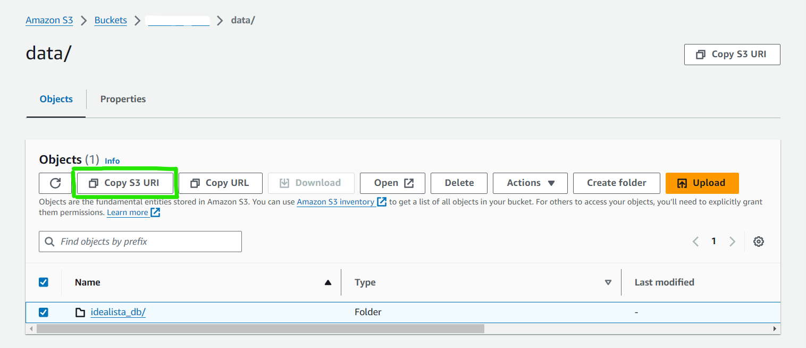

A Database in the Glue Catalog is just a logical grouping of table definitions so we don't strictly need to set the location, i.e. we could asociate a table from anywhere to a Database. However is conceptually cleaner to asociate the Database to some location, and all the sub-folders will correspond to Table definitions. 

## Define the table in the Glue Data Catalog

Under the *Data Catalog* open up the *Tables* tab. There are two ways to add Tables, the tedious way of manually entering all the schema and using a crawler. We will be using a crawler. 

### Creating the crawle 
Go to *Add tables using a crawler*. 

**Step 1** Enter a name and go to the next step. 

**Step 2** Choose data sources and classifiers
1. Select *Not yet* in data already mapped to Glue tables. 
2. Add a datastore
    * The datasource is S3.
    * Leave the *Network connection* empty.
    * For the S3 path, go to the S3 bucket and select the `data/idealista_db/idealista/` folder and *Copy the S3 URI*.
    * Select *Crawl all sub-folders*.
    * *NOTE* The Exclude pattern can be very useful if your data contains non-data objects that should not be crawled. [See here](https://docs.aws.amazon.com/glue/latest/dg/define-crawler.html#crawler-data-stores-exclude)

**Step 3** Configure security settings
1. Select `LabRole` for the IAM role. This will allow Glue to access the S3 bucket. 

**Step 4** Set output and scheduling
1. Select database you created earlier as the target database.
2. Set the maximum table threshold to 1. We are expecting only one table with multiple partitions to be created, but in case of some misconfiguration, we want the crawler to throw an error if it is trying to create more. A misconfigured crawler can easily create hundreds of tables. 
3. Expand the *Advanced options* for the *Output configuration*. Select **Update all new and existing partitions with metadata from the table**
4. Select *On demand* for the *Crawler schedule*.

### Running the Crawler
You can now run the crawler. It will take around 1 minute to run. Once it is finished go to the *Tables* tab and hit refresh. 
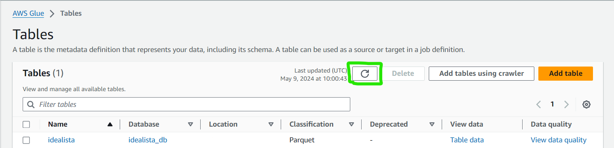

A table named `idealista` should have been created. 

#### Explore the table

Enter the table and see that the crawler automatically infered the schema of the files, even complex types like the `detailedtype` which is a struct with nested attributes. Under the *partitions* you can see that the `ingestion_date` has been correctly identified as the partion index. 
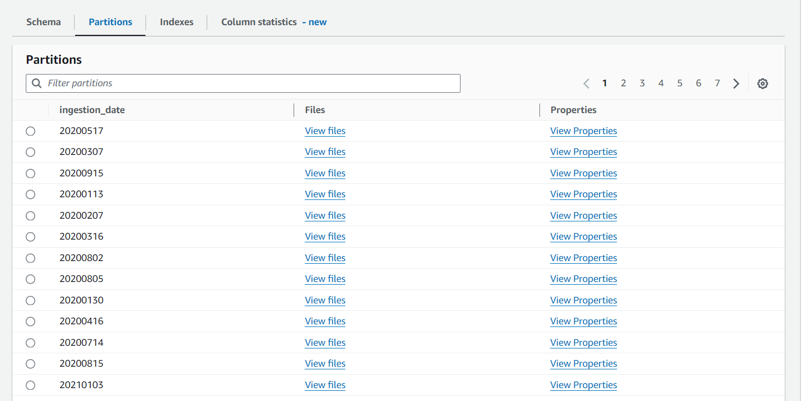. 

## Create an ETL job

We want to go to the *ETL Jobs* tab and select *Visual ETL* to author a job in a visual interface focused on data flow.

**Step 1:**
Once in the job visual designer, select AWS Glue Data Catalog in order to select the source database defined previously. Configure the source by giving it a name, selecting the database created before and selecting the `idealista_db` table. Make sure to specify the 'LabRole' IAM role for the job. Under the *Job Details* page, make sure that the *LabRole* is selected as the IAM role, *Spark* as the type of ETL job and *Python* as the language, and the Scripts and Temp folder paths defined in S3 at the beginning of this tutorial.
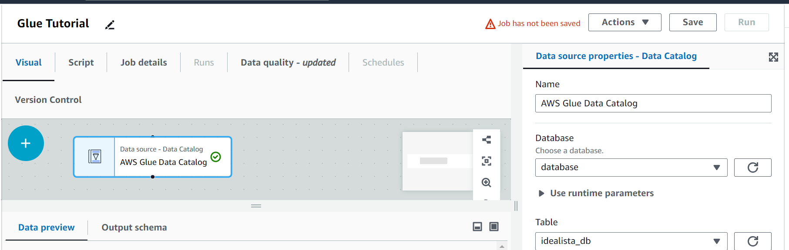
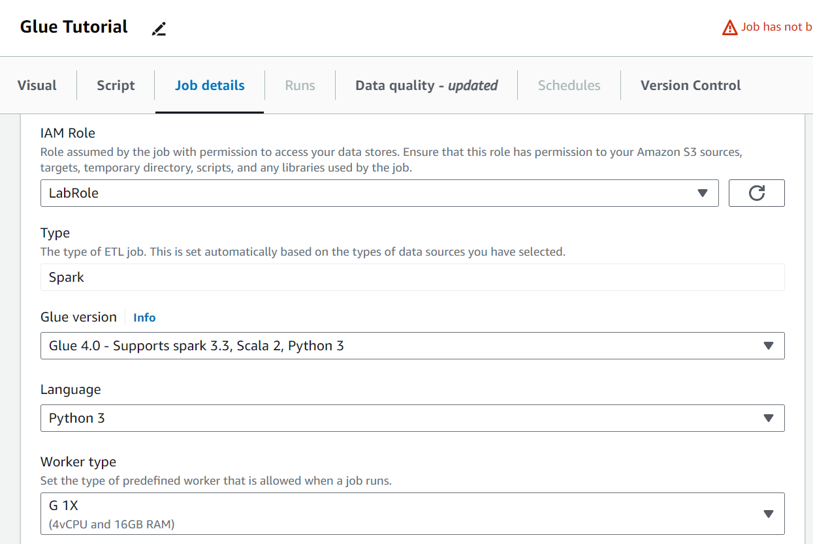

**Step 2:**
Create a data target, by creating a new folder under S3>data>idealista_db called `idealista-json` and selecting it as the Data Target - S3 bucket back in Glue.
Optionally, check the script that has been created automatically based on the job configurations defined in the visual tool, under the *Script* tab. You can also edit the script directly in the console.

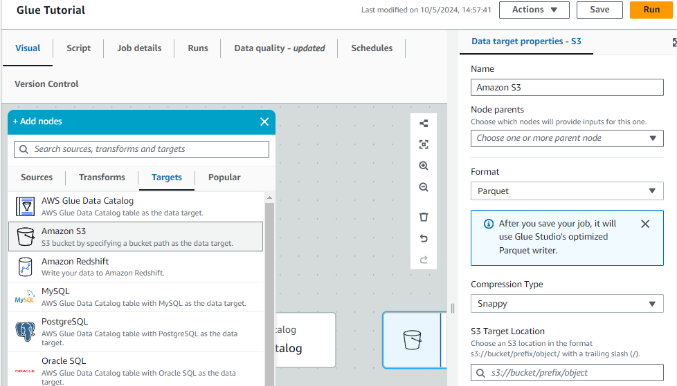

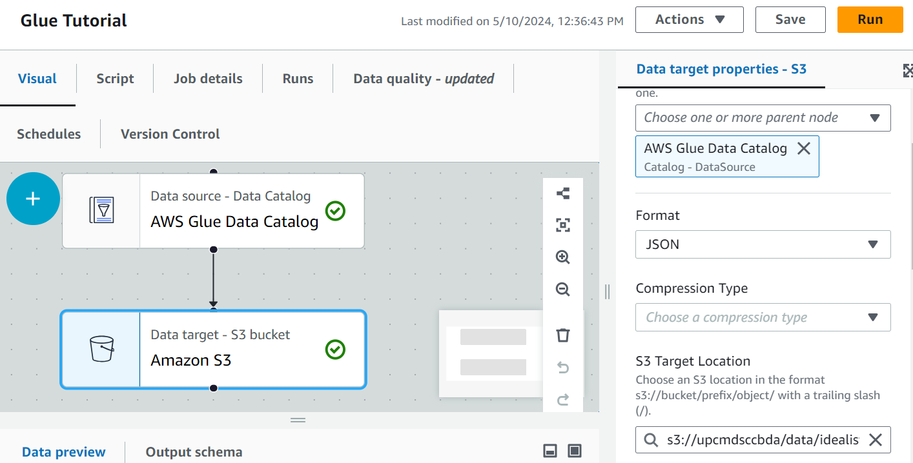

**Step 3:**
Hit *Save* to save the job.
Run the job by clicking on *Run job* and monitor the progress of the job in the *Runs* tab.
When the run status is *Succeeded*, check the output in the S3 bucket to see the transformed data in JSON format.

## Set triggers for the jobs
AWS Glue triggers allow setting different triggers based on scheduled time or event for the different ETL jobs. To set a trigger, first let's navigate to the *Data integration and ETL* tab and there select *Triggers*.

### Setting a schedule trigger

**Step 1:**
Select *Add Trigger*, name the trigger, and on the *Trigger type* box select *Schedule*. Here one can set the schedule with which they want the job to be executed. Set the frequency to daily and to start at the desired hour. Once this is done, select *Next*.

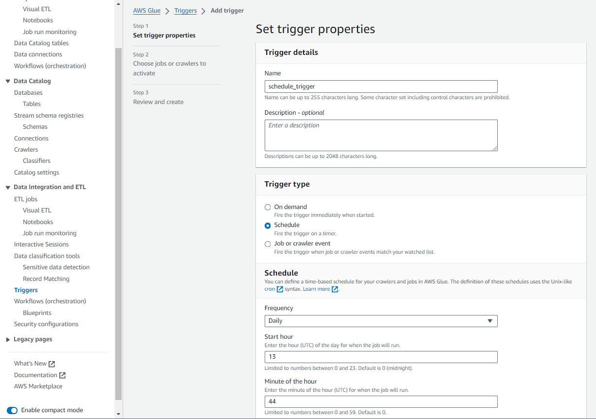

**Step 2:**
The next step allows assigning which jobs or crawlers will be activated once the trigger conditions are met. Select the *Add target resource*, choose *Crawler* as the resource type, and select the previously created crawler. Once this is done, hit *Next*, review everything is correct, and select *Create*.

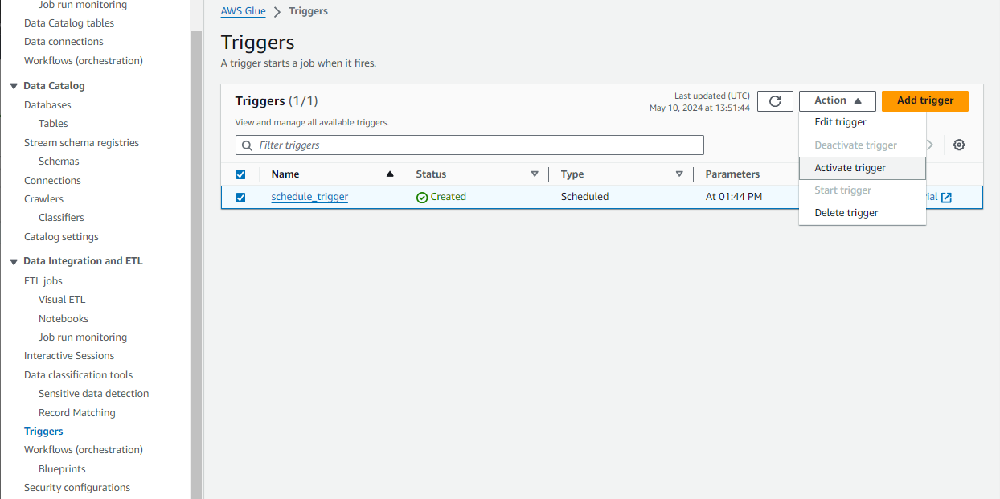

**Step 3:**
Once the trigger is created, it is necessary to activate it. To do so, select the trigger and in *Action* select *Activate trigger*. Once this is done, the trigger will be activated and the job or crawler will be executed every day at the desired time. To deactivate the trigger, just select it again and in *Action* hit *Deactivate trigger*.

### Setting an event trigger

**Step 1:**
Select *Add Trigger*, name the trigger, and on the *Trigger type* box select *Job or crawler event*. Here we can set the jobs and crawlers and their results as the activation conditions of the trigger. Select *Add a watched resource*, choose *Crawler*, the crawler that was created before, and in *Status* set it as *Succeeded*. Once this is done, hit *Next*.

**Step 2:**
The next step allows assigning which jobs or crawlers will be activated once the trigger conditions are met. Select the *Add target resource*, choose *Job* as the resource type, and select the previously created job. Once this is done, hit *Next*, review everything is correct, and select *Create*.

**Step 3:**
Once the trigger is created, it is necessary to activate it. To do so, select the trigger and in *Action* select *Activate trigger*. One thing to take into account is that to activate the trigger, it is necessary that the job or crawler set as the watched resources need to be activated by a trigger, so even if the crawler is run manually this trigger will not activate.

**Step 4:**
We can test the event trigger and the scheduled trigger at the same time, by setting the time of the scheduled trigger close to the actual time (UTC time), and activating this trigger. Once the time arrives, the trigger will make the crawler run, and when that is completed the event trigger will activate and the job will run. To see if the job ran successfully you can check that in the tab *Data integration and ETL* by selecting *Job run Monitoring*. Once this test is done, deactivate both triggers.

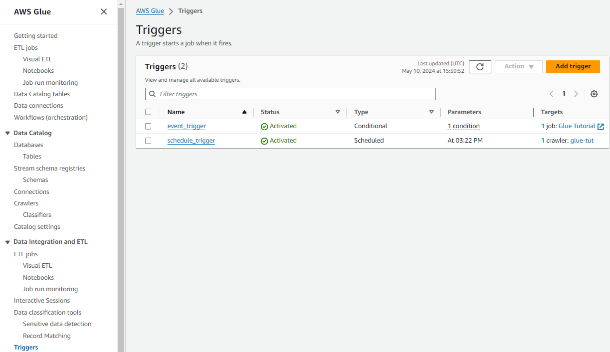

### Summary
In this tutorial we saw how AWS Glue can manage metadata about a source, how we can create ETL pipelines using Glue's visual job builder, and how we can schedule these jobs based on events or schedule. 
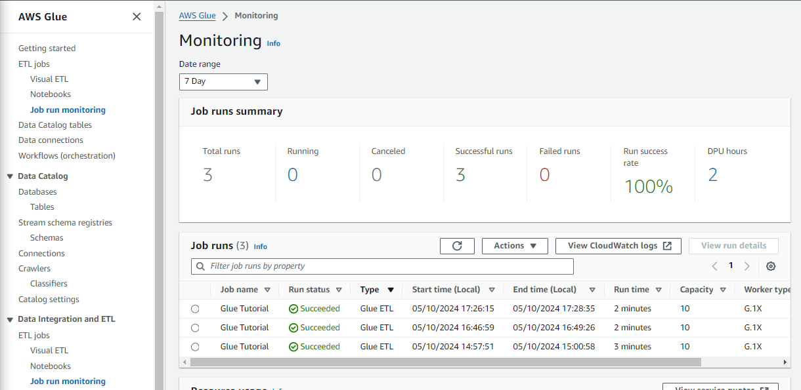

