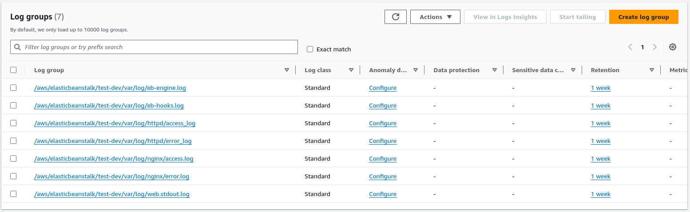
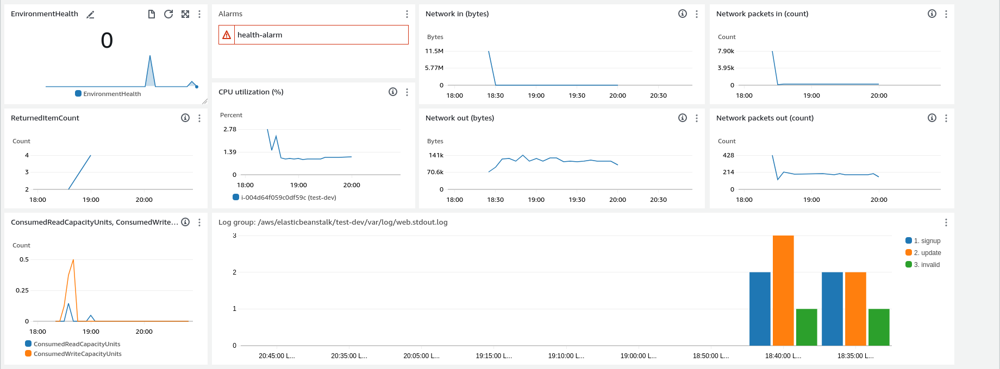
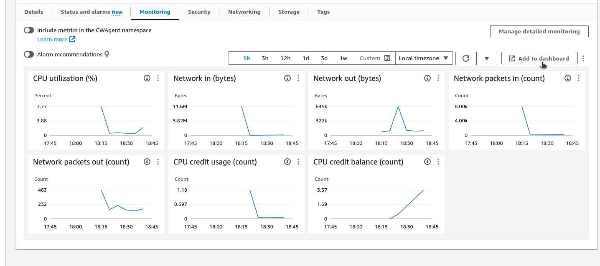
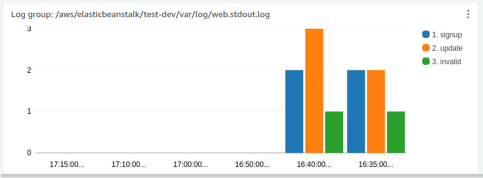

# CCBDA-ResearchProject-4

In this lab you are going to use Cloud Watch to monitor you cloud infrastructure.

Cloud Watch Dashboards are used to visualize the status, quantities, cost over time and other characteristics of you cloud resources in order to facilitate the control over them.

You will first create a basic Virtual Cloud setup, this will be based on the setup we used in Lab 5, using Elastic Beanstalk to deploy a web application. The application consists of a web portal and a DynamoDB where users can enter their email to register to the mailing list for an upcoming Cloud Computing course.
Once the system is up and running you will explore the different options that CloudWatch offers to create a dashboard and monitor your Cloud System.

### Task 1: Deploy a web App

We will start by deploying a web applications by means of elastic beanstalk. As the main goal of this tutorial
is to visualize the cloud rather than learn how to create the infrastructure in it, we provide you a .zip folder 
with the code of the web app and the instructions on how to set it up.

You can find all needed files in the `data.zip` file. Unzip it.

In order for the deployment to work correctly, you will first need to get the credentials to connect to your AWS account. 

To get them you can launch your Learner Lab and execute the command `cat ~/.aws/credentials` or use the `AWS Details` button and then show the `AWS CLI`.

You should get something like:

````bash
_$ cat ~/.aws/credentials
[default]
aws_access_key_id = <YOUR-ACCESS-KEY-ID>
aws_secret_access_key = <YOUR-SECRET-ACCESS-KEY>
aws_session_token = <YOUR-AWS-SESSION-TOKEN>
````

Then, you should update the file `env.txt` inside the unziped `data.zip` with the following information:

```bash
_$ cat env.txt
AWS_REGION = us-east-1
DEBUG = True
STARTUP_SIGNUP_TABLE = gsg-signup-table
aws_access_key_id = <yours>
aws_secret_access_key = <yours>
aws_session_token = <yours>
```

In order to be able to deploy the application using the AWS Elastic Beanstalk you need an environment with both `awscli` and `awsebcli` packages installed. For this tools to work you should also copy the same output from `~/.aws/credentials` from your Learner Lab to your local machine in the same fie `~/.aws/credentials`.

Now we are ready to setup the Beanstalk application.

First run the bash script `create.table.sh`. This will create a DynamoDB table called `gsg-signup-table` that will be used to store the emails that are entered into the application.

Now change the directory to the unziped application for example `cd test` as we will be working from there for the rest of the tutorial.

Next, you need to configure your directory to be usable by Elastic Beanstalk. To do so follow the instruction below:

```bash
_$ eb init -i
Select a default region
...
1) us-east-1 : US East (N. Virginia)
...
(default is 3): 1

Enter Application Name
(default is "test"):
Application test has been created.

Select a platform.
...
9) Python
...
(make a selection): 9

Select a platform branch.
2) Python 3.9 running on 64bit Amazon Linux 2023
...
(default is 1): 2
Do you wish to continue with CodeCommit? (y/N): n
Do you want to set up SSH for your instances?
(Y/n): n
```

Once you have finished this setup, you can run the `python ebcreate.py` script. This will return a command like `eb create -ip ...` that you need to copy and paste to the console in order to create the eb application (use all the default options).

After you see the message stating that the environment is successfully launched you will need to execute the following line in order to activate the CloudWatch logs of your application.
```bash
eb logs --cloudwatch-logs enable
```
This will create CloudWatch log groups for the different instance logs like `/aws/elasticbeanstalk/test-dev/var/log/web.stdout.log` where the output from the application is logged.

Go to the AWS Console and look for the Cloud Watch service. If you go to the `Logs > Log groups` you should be able to see the added logs for our application that the Elastic Beanstalks has created for us.


Later we will use this logs to create metrics that will be shown in our dashboards.

The last thing to setup is to create some activity on the application. Open the application using `eb open` and signup some emails with it to create some registers in the database:
* Register some valid emails.
* Try to register the same email twice.
* Try to register some invalid emails (for simplicity the condition for an invalid email is that it does not contain an _@_ symbol).

### Task 2: Visualization

Now that we have some data its time to create a dashboard to display relevant information from our resources and services. The end result will look something like this:


#### 2.1: Visualize the state of the application

Go to the `CloudWatch > Dashboards`, there you can use some automatic dashboards already created with common widgets for typical use cases or create a custom dashboard. Select _Custom dashboards_, "Create Dashboard" and name it `lab-dashboard`.

Inside a dashboard we can add widgets and filter data on a specific time range.

Each widget has a data source, we will be using the CloudWatch data source and a widget configuration for the data type and widget type.

The first plot that we will be adding to the lab-dashboard will show us the status of the application's health. In particular, for every timestamp, it will show one of the following values:
  * 0 - OK
  * 1 – Info
  * 5 – Unknown
  * 10 – No data
  * 15 – Warning
  * 20 – Degraded
  * 25 – Severe

In order to add it, from the dashboard you should add a widget with the `+` button and select the following options:
  * Data source types: CloudWatch
  * Data type: Metrics
  * Widget type: Number

Once you have selected the right options, click on Next and browse for `Elastic Beanstalk metrics > Environment metrics`, select the environment of our application and click Create widget.


#### 2.2: Visualize EC2 instance metrics

Before leaving the dashboard remember to save manually or activate the autosave button in the top right corner. Otherwise you would lose your changes if you leave the page.

We can also add to the Dashboard the metrics related to the EC2 instance that is being used. To do this, we can to go to the EC2 menu in the AWS Console and select the instance where the web server is running. 
Then, as the Figure below shows, scroll down and select the _Monitoring_ tab, click on _Add to dashboard_, and select the _lab-dashboard_ that you have created. 
This will add all available metrics for an EC2 instance (you cannot just import a selection of the metrics to the dashboard), feel free to delete those that are not interesting to you. 
.

For now, you can just keep the plots named _CPU utilization_, _Network in (bytes)_, _Network out (bytes)_, _Network packets in (count)_, and _Network packets out (count)_. If you are unsure of the meaning of a certain metric you can place your cursor on top of the _(i) - information symbol_, and its description will be displayed.


#### 2.3: Visualize DynamoDB metrics
Since we are storing data in a DB, we might also want to know something about the database usage. It could be interesting to know how much reading or writing capacity is being used. 
Click on the "+" sign on the dashboard creation menu (top right corner) and select a line plot and inside `DynamoDB > Table Metrics` select both the _ConsumedReadCapacityUnits_ and the  _ConsumedWriteCapacityUnits_ of the DB table were the users are being stored (make sure you are selecting the right table!). Finally, click on Create Widget and the graph will be directly added to the dashboard.
If you want to observe the metrics separately (two different graphs), you can just select them individually and create a graph for each.

**Q1**: Try to create a line plot widget to show a metric more directly related to the the number of users managed by the database. Tip: use some metric from `Table Operation Metrics`.


#### 2.4: Logs visualization
Finally, we can also add graphs showing metrics derived from the logs of our application. To do this go to the "+" sign in the dashboard creation menu and select `Logs` as the Data type and `Bar` for the Widget type.

Then with Logs Insights you can apply custom filter operations to the different logs created by your application in the Elastic Beanstalk. As an example we will create a bar plot showing the amount of new uses registered every 5 minutes.

To do this first we need to specify the Log Groups we want to use. Select the group from the previously created Beanstalk application `/aws/elasticbeanstalk/test-dev/var/log/web.stdout.log` and copy the following code to the text editor.

```
fields @timestamp, @message 
| parse @message "New item added to database." as m
| stats count(m) as signup by bin(5m)
```

This query will parse message logs from the application with "New item added to database." and count them in bins of 5 minutes. If you click `Run query` you should already see come results below. 

There are many options for Log Insights queries, for example you can monitor the latency of some lambda function. You can explore common queries in the `Queries` button on the right side panel or even use natural language to generate the query using an AI assisted _Query generator_ (use with caution).

**Q2**: Try to expand this bar plot to also include bars showing the count for two other messages that the application is creating: "Existing item updated to database." and "Email address is invalid." you only need to slightly modify the previous query.

You should be able to generate a plot similar to the following one:


#### 2.5: Setting an alarm

In addition to metrics and logs data types we can also add widgets for existing alarms. In this case we want to set an alarm for the health of the Beanstalk application, so first we need to create the alarm.

Go to `Cloudwatch > Alarms > All alarms` and click on `Create alarm` select the same metric we used in task 2.1 `ElasticBeanstalk > Environment Metrics > EnvironmentHealth` set the statistic to maximum and the period to 15 minutes. For the condition select greater or equal than 5 and finally send the notifications to the `Default_CloudWatch_Alarms_Topic` and name the alarm `health-alarm`.

To add a widget for this alarm go to the dashboard and click the "+" sign. Select `Alarms` as the Data type and `Alarm status` for the Widget type, click next and you should see already existing alarms automatically created for the autoscaling of the application and the custom `health-alarm`. Select the health alarm and add it to the dashboard.

**Q3**: Try to stop the EC2 instance and wait some minutes. How do you observe this problematic situation in the dashboard?

When you are done remember to run `eb terminate` and delete any other resources in use like the DynamoDB table `gsg-signup-table`, alarms etc.
