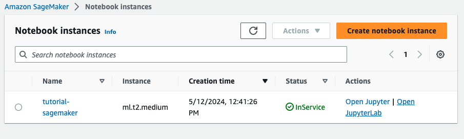
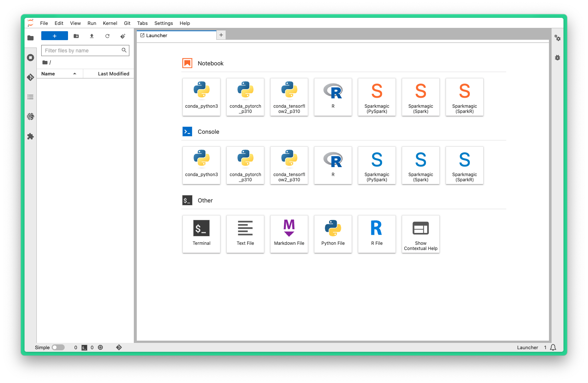
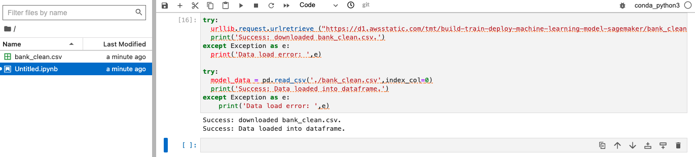
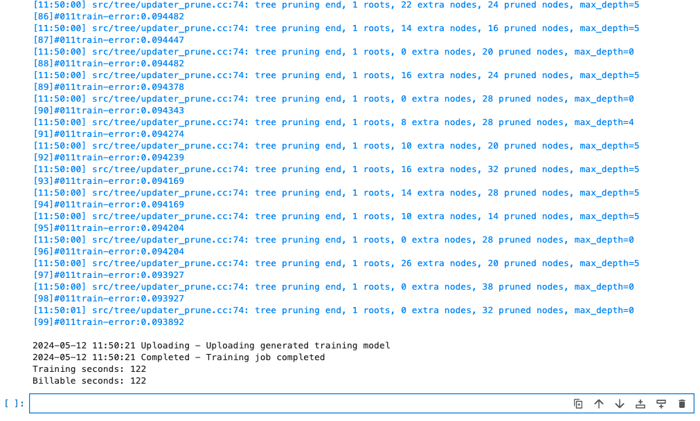
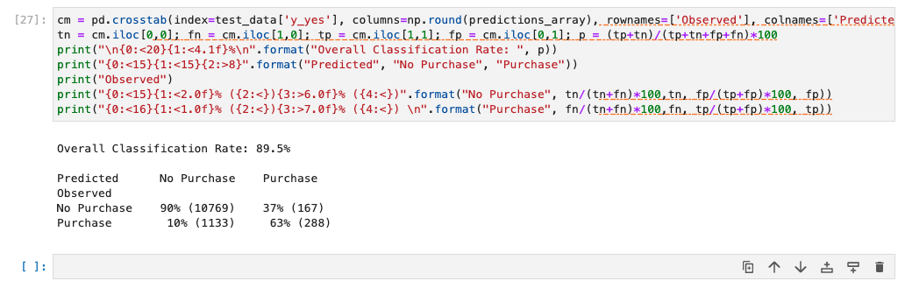

# Tutorial on Amazon AWS SageMaker

In this tutorial we are going to explain how to use AWS SageMaker. Amazon SageMaker is a fully managed service provided by Amazon Web Services (AWS) that enables developers and data scientists to build, train, and deploy machine learning models with large scalability. 
It simplifies the process of building, training, and deploying machine learning models by providing an integrated environment with all the tools and infrastructure needed.

## Table of contents

1. [Useful links](#useful-links)
2. [Introduction to AWS SageMaker](#introduction-aws-sagemaker)
3. [Get started](#get-started)

## Useful links

These are some useful resources that provide some additional information on AWS SageMaker:
- [The official website of AWS SageMaker](https://aws.amazon.com/sagemaker/)
- [Introduction to AWS SageMaker Studio](https://youtu.be/YcJAc-x8XLQ?si=hF6DXabhZO8dPu-h)

## Introduction AWS SageMaker

How can we use Amazon SageMaker? Amazon SageMaker is a cloud machine learning platform that helps users build, train, tune and deploy machine learning models in a production-ready, hosted environment. It is a type of machine learning service that is already hosted on the AWS platform. 

One of the key benefits of using AWS SageMaker is that it reduces machine learning data cost. This means that you can optimize your cost while running this particular service on AWS. Moreover, all ML components are stored in a particular place in a dashboard, so they can be managed together. It provides high scalability, and you can scale this particular service while it is running. 

It also trains the model faster and maintains uptime, so you can be sure that your workloads are always available. It also guarantees a high level of data security. This is particularly beneficial as security is a major concern on cloud platforms. Finally, you can use these simple data transfer techniques to transfer data to various AWS services such as S3 buckets and others.

Machine learning with AWS SageMaker is composed by three main steps:
- **Build**: SageMaker offers over 15 widely used ML algorithms for training purposes. You can build a model by collecting and preparing training data or selecting from the Amazon S3 bucket. Additionally, you can choose and optimize the required algorithm. Examples of selectable algorithms include K-means, linear regression, and logistic regression. SageMaker also enables developers to customize ML instances using the Jupiter Notebook interface.
  
- **Test and Tune**: In this phase, you need to set up and manage the environment for training. Sample data is required to train the model. SageMaker implements hyperparameter tuning, it allows to adjust algorithm parameters and divides the training data, storing it in Amazon S3. The training algorithm code is stored in the Elastic Container Registry (ECR), and it facilitates the saving, monitoring, and deployment of containers such as dockers.
  
- **Deploy**: Once tuning is complete, models can be deployed to SageMaker endpoints. For limited data predictions, Amazon SageMaker hosting services are utilized, while for entire dataset predictions, Amazon SageMaker Batch Transform is preferred. Real-time prediction occurs in the endpoint, so it enables the validation of model accuracy and the evaluation of the business goals.


## Get started

In this tutorial, we'll focus on creating a simple machine learning model using AWS SageMaker. To keep the process straightforward and accessible, especially for beginners, we'll use default settings for configurations like Virtual Private Clouds (VPCs) and user roles. This approach is designed to help you quickly understand and utilize SageMaker's core capabilities without the initial complexity of advanced configurations. However, please be aware that in a production environment, you should configure these settings according to your security and operational requirements to ensure the protection and efficiency of your resources.

Get started with AWS SageMaker:

As a machine learning developer for the marketing department of a bank you need to predict if a customer will enroll for certificate of deposit. The marketing dataset contains bank information on customer demographics, response to marketing events, and external environment factors. The data is labeled, meaning there is a column in the dataset that identifies whether the customer is enrolled for a product offered by the bank. For this example scenario, you will use a publicly-available dataset from the ML repository curated by the University of California, Irvine.

1. **Sign Up for AWS**: If you haven't already, sign up for an AWS account. You'll need to provide payment information, but there's a Free Tier available which includes limited usage of many AWS services, including SageMaker.

2. **Navigate to SageMaker Console**: Once you're logged into your AWS account, navigate to the SageMaker console. You can find it under the "Machine Learning" section of the AWS services.

3. **Create a Notebook Instance**: In the SageMaker console, click on `Notebook` and `Notebook instances` in the left sidebar, then click on the `Create notebook` instance" button:
   - Name: `tutorial-sagemaker`
   - Notebook instance type: `ml.t2.medium`
   - Let everything as default and click on `Create notebook instance`



4. **Open Jupyter Notebook**: Once your notebook instance is ready (about 5 minutes), click on `Open JupyterLab` next to the instance name. This will open a new tab in your browser with the Jupyter Notebook interface.



5. **Start Coding**: You can now start writing code in your Jupyter Notebook. SageMaker supports several popular machine learning libraries like TensorFlow, PyTorch, and scikit-learn. You can also use SageMaker's built-in algorithms for common machine learning tasks. 
   
   Let's create a new Python notebook file:
   - File > New > Notebook
   - Select kernel: `conda_python3`

Copy and paste this code in the file:
```{python}
# import libraries
import boto3, re, sys, math, json, os, sagemaker, urllib.request
from sagemaker import get_execution_role
import numpy as np
import pandas as pd
import matplotlib.pyplot as plt
from IPython.display import Image, display
from time import gmtime, strftime
from sagemaker.serializers import CSVSerializer
from sagemaker.inputs import TrainingInput

# Define IAM role
role = get_execution_role()
prefix = 'sagemaker/DEMO-xgboost-dm'
containers = {
    'us-west-2': '433757028032.dkr.ecr.us-west-2.amazonaws.com/xgboost:latest',
    'us-east-1': '811284229777.dkr.ecr.us-east-1.amazonaws.com/xgboost:latest',
    'us-east-2': '825641698319.dkr.ecr.us-east-2.amazonaws.com/xgboost:latest',
    'eu-west-1': '685385470294.dkr.ecr.eu-west-1.amazonaws.com/xgboost:latest'
}

my_region = boto3.session.Session().region_name  # set the region of the instance
print("Success - the MySageMaker Instance is in the " + my_region + " region. You will use the " + containers[my_region] + " container for your SageMaker endpoint.")
```

You will need a S3 bucket to store your training data once you have processed it. So in the next cell paste this:
```{python}
bucket_name = 'your_bucket_name'  # <--- CHANGE THIS VARIABLE TO A UNIQUE NAME FOR YOUR BUCKET
s3 = boto3.resource('s3')

try:
    if my_region == 'us-east-1':
        s3.create_bucket(Bucket=bucket_name)
    else:
        s3.create_bucket(Bucket=bucket_name, CreateBucketConfiguration={'LocationConstraint': my_region})
except Exception as e:
    print('S3 error:', e)
```
If you get the error, try with a random name.

Now, you need to download the data to your SageMaker instance and load it into a dataframe. In the next cell paste this code:
```{python}
try:
  urllib.request.urlretrieve ("https://d1.awsstatic.com/tmt/build-train-deploy-machine-learning-model-sagemaker/bank_clean.27f01fbbdf43271788427f3682996ae29ceca05d.csv", "bank_clean.csv")
  print('Success: downloaded bank_clean.csv.')
except Exception as e:
  print('Data load error: ',e)

try:
  model_data = pd.read_csv('./bank_clean.csv',index_col=0)
  print('Success: Data loaded into dataframe.')
except Exception as e:
    print('Data load error: ',e)
```

We get the new file in the directory: `bank_clean.csv`.



At this point we need to train and test the model. We use a cross data validation: we shuffle the data, and then we take the 70% to train the model, while the remaining 30% is used to test the model.

In order to crate the dataset that we are going to use, we use Numpy library. Let's paste this code in a new cell:
```{python}
train_data, test_data = np.split(model_data.sample(frac=1, random_state=1729), [int(0.7 * len(model_data))])
print(train_data.shape, test_data.shape)
```

Now, train the model like that:
```{python}
pd.concat([train_data['y_yes'], train_data.drop(['y_no', 'y_yes'], axis=1)], axis=1).to_csv('train.csv', index=False, header=False)
boto3.Session().resource('s3').Bucket(bucket_name).Object(os.path.join(prefix, 'train/train.csv')).upload_file('train.csv')
s3_input_train = TrainingInput(s3_data='s3://{}/{}/train'.format(bucket_name, prefix), content_type='csv')
```
With this, we obtain a new file called: `train.csv`

Next, you need to set up the SageMaker session, create an instance of the XGBoost model (an estimator), and define the model’s hyperparameters.

```{python}
sess = sagemaker.Session()
xgb = sagemaker.estimator.Estimator(containers[my_region],role, instance_count=1, instance_type='ml.m4.xlarge',output_path='s3://{}/{}/output'.format(bucket_name, prefix),sagemaker_session=sess)
xgb.set_hyperparameters(max_depth=5,eta=0.2,gamma=4,min_child_weight=6,subsample=0.8,silent=0,objective='binary:logistic',num_round=100)
```

With the data loaded and XGBoost estimator set up, train the model using gradient optimization on the instance:

```{python}
xgb.fit({'train': s3_input_train})
```
This allows to start the training job. It will take a bit. The result should be something like this:


Now, we can deploy the model. Be careful to use the same instance type we defined initially.
```{python}
xgb_predictor = xgb.deploy(initial_instance_count=1,instance_type='ml.t2.medium')
```
Wait until the loading bar shows the `!` symbol. It will take a bit. The result should be something like that:


To predict whether customers in the test data enrolled for the bank product or not, let's execute this code:

```{python}
test_data_array = test_data.drop(['y_no', 'y_yes'], axis=1).values #load the data into an array
xgb_predictor.content_type = 'text/csv' # set the data type for an inference
xgb_predictor.serializer = CSVSerializer() # set the serializer type
predictions = xgb_predictor.predict(test_data_array).decode('utf-8') # predict!
predictions_array = np.fromstring(predictions[1:], sep=',') # and turn the prediction into an array
print(predictions_array.shape)
```

This should be the result that you get:
```{bash}
(12357,)
```

Now, let's evaliuate the result:
```{python}
cm = pd.crosstab(index=test_data['y_yes'], columns=np.round(predictions_array), rownames=['Observed'], colnames=['Predicted'])
tn = cm.iloc[0,0]; fn = cm.iloc[1,0]; tp = cm.iloc[1,1]; fp = cm.iloc[0,1]; p = (tp+tn)/(tp+tn+fp+fn)*100
print("\n{0:<20}{1:<4.1f}%\n".format("Overall Classification Rate: ", p))
print("{0:<15}{1:<15}{2:>8}".format("Predicted", "No Purchase", "Purchase"))
print("Observed")
print("{0:<15}{1:<2.0f}% ({2:<}){3:>6.0f}% ({4:<})".format("No Purchase", tn/(tn+fn)*100,tn, fp/(tp+fp)*100, fp))
print("{0:<16}{1:<1.0f}% ({2:<}){3:>7.0f}% ({4:<}) \n".format("Purchase", fn/(tn+fn)*100,fn, tp/(tp+fp)*100, tp))
```
This is the final result:



The model correctly predicted customer decisions with an accuracy of 89.5%, demonstrating a strong capability in distinguishing between those who would and would not enroll. It performed particularly well in identifying customers who did not sign up for the product.

6. **Save Your Work**: Don't forget to save your work periodically by clicking on the "Save" button in the Jupyter Notebook interface.

7. **Clean Up**: When you're done with your notebook instance, make sure to stop or delete it to avoid incurring unnecessary charges.

In this tutorial, we used AWS SageMaker to solve a practical problem in the financial sector that involves predicting customer enrollment for a banking product. By using machine learning, we efficiently processed data and created a model that helps make informed marketing decisions. This approach not only increases the effectiveness of marketing strategies, but also demonstrates the power of machine learning in improving business outcomes. Developers can continue to experiment with SageMaker, refining and customizing their methods to meet specific business needs and challenges, which can lead to even higher accuracy and more targeted insights.

