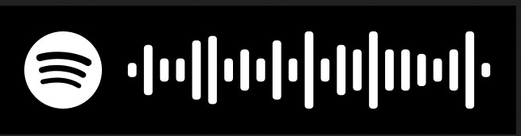
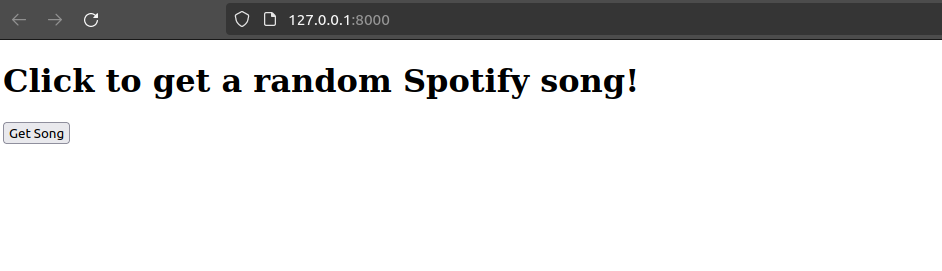
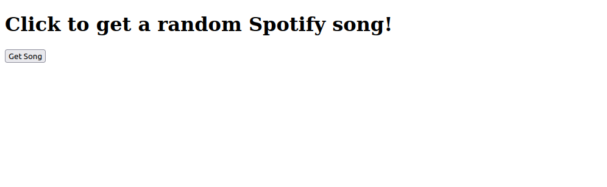
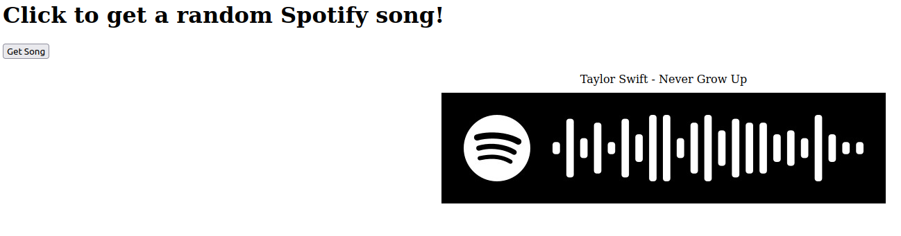

# Research topic: Spotify Integrated App
The idea is to have a website with which you get a random song name with its artist and spotify code. The spotify codes look like this:



You can try to scan the code with your spotify app (Go to the search bar and click on the camera symbol). We will be using the Spotify API for getting the random song and for the deployment we will use AWS Elastic Beanstalk. 

## Prerequesites
1. You need to have a spotify account (either free or premium). If you don't have an account, you have to register here https://www.spotify.com/es/signup

## Getting a random song of the Spotify API
### Create an App
1. Go to https://developer.spotify.com/ and log yourself in with your spotify account.

2. Go to your dashboard (Click on your name and then Dashboard) and create a new app. With the following properties:
    - ```App name = ccbda_research```
    - ```App description = Research topic for CCBDA```
    - ```Redirect URIs = http://localhost:3000``` (you don't need that but it is mandatory to specify)

3. Leave the rest blank and click the Developer Terms of Service checkbox and tap on the Create button

### Get the access token
1. After creating your app go to the settings of the app. Save your Client ID and your Client secret (available when you click on ```View client secret```) 

2. Go ahead and clone the following repository https://github.com/Johnhi19/research.git


3. in the ```spotify_script.py``` file, replace ```YOUR-CLIENT-ID``` and ```YOUR-CLIENT-SECRET``` with the Client ID and the Client secret of your app. The ```get_token()``` function creates an access token valid for one hour. You need to have a valid access token when calling the Spotify API. The token should look something like this: 
```
BQDBKJ5eo5jxbtpWjVOj7ryS84khybFpP_lTqzV7uV-T_m0cTfwvdn5BnBSKPxKgEb11
```

4. To get a random song look at the ```request_valid_song``` function. This function calls the Spotify API and searches for a random song. When it doesn't find a valid song, it rick rolls you. When executing this code, you should get a random song with its artist and spotify code.

## Creating a web page using flask
The ```application.py``` file is a simple flask script that deploys the python code to a web page. To execute the code locally, you first need to create a venv and run the following command inside:
```
(venv) _$ pip install -r requirements.txt
```
This downloads all the dependencies needed.

To test the app locally use the following command:
```
(venv) _$ python3 application.py
```
You can open the web app locally on the following IP address http://127.0.0.1:8000. It should look like this:



You can play around a bit by clicking on the get song button.

## Deploy your application with AWS Beanstalk
1. Zip the folder of the code. You can either use the UI or the command line. But make sure that everything is included (your virtual environment is not necessary). Use the following command in linux to zip your folder (maybe you have to replace venv with the name of your virtual environment):
```
zip -r application.zip ./ -x "/venv/*"
```
2. Start your learners lab and go to the Elastic Beanstalk console
3. Go to Applications > Create application
4. as the name choose ```research-ccbda``` and click create
5. In your application choose create environment
6. Configure the environment
- For the name use ```research```
- Platform is Python 3.11
- Choose Upload your code and then local file and choose your zip file as version label choose ```application```
- Click next
7. Configure service access
- As existing service roles choose LabRole
- EC2 key pair is vockey
- EC2 instance profile is LabInstanceProfile and click next
8. Skip all the other configurations and click submit at the end. Your environment is launching which might take a while.
9. After the environment successfully launched, click on the domain provided by the environment. Your website should open up in another windew. The website should look like this:



This is how the website looks after clicking on the get song button:



In the end don't forget to terminate your environment and also the spotify app.
