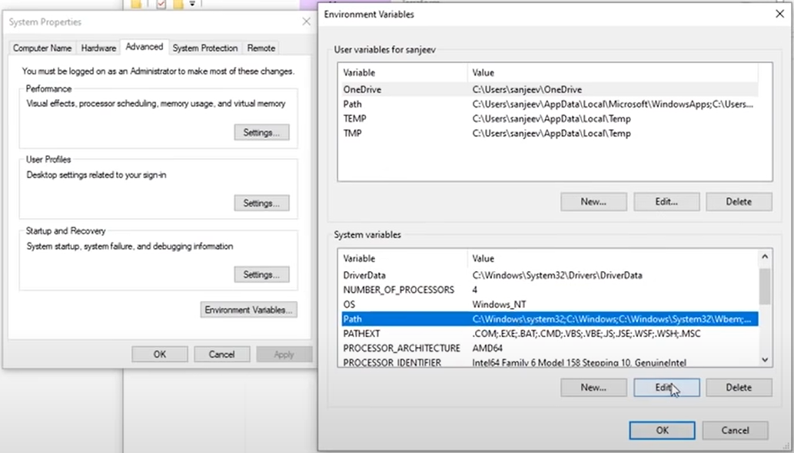
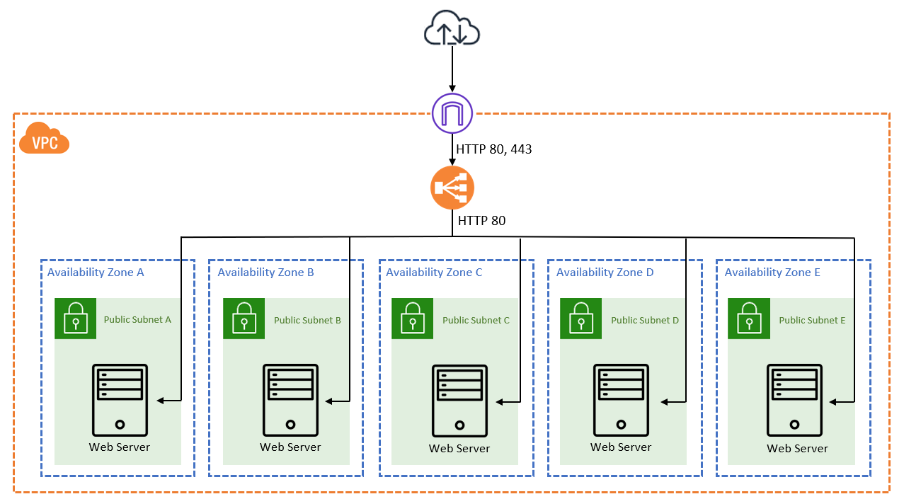
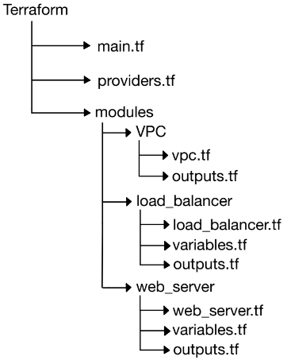

# CCBDA-terraform-research

This lab aims to provide a [Terraform](https://www.terraform.io/) overview. Terraform is an open-source infrastructure as code software tool created by HashiCorp. It allows users to define and provision data center infrastructure using a high-level configuration language called HashiCorp Configuration Language (HCL), or optionally JSON.

First, a quick introduction of some of its key features:
<ul>
    <li> 
        <strong>Infrastructure as Code (IaC)</strong>: Terraform enables you to manage your infrastructure using code, treating your infrastructure as you would any other piece of software. This approach offers benefits like version control, repeatability, and ease of collaboration.
    </li>
    <li>
        <strong>Declarative Syntax</strong>: With Terraform, you define the desired state of your infrastructure in configuration files. Terraform then takes care of figuring out how to make the current infrastructure match that desired state.
    </li>
    <li>
        <strong>Multi-Cloud Provisioning</strong>: Terraform supports multiple cloud providers such as AWS, Azure, Google Cloud Platform, and many others. It also supports on-premises infrastructure and even SaaS providers.
    </li>
    <li>
        <strong>Resource Graph</strong>: Terraform builds a dependency graph from your configuration files, allowing it to determine the order in which resources should be created or destroyed. This ensures that resources are provisioned in the correct sequence and dependencies are handled properly.
    </li>
    <li>
        <strong>Execution Plans</strong>: Before making any changes to your infrastructure, Terraform generates an execution plan. This plan outlines what Terraform will do when you apply your configuration, giving you a chance to review and approve changes before they are made.
    </li>
    <li>
        <strong>Modularity and Reusability</strong>: Terraform encourages modular and reusable configurations through the use of modules. Modules allow you to encapsulate and share infrastructure configurations, making it easier to manage and scale your infrastructure.
    </li>
    <li>
        <strong>State Management</strong>: Terraform keeps track of the state of your infrastructure in a state file. This state file is used to map your real-world resources to your configuration, enabling Terraform to determine what changes need to be made to your infrastructure.
    </li>
</ul>

Overall, Terraform simplifies and automates the process of managing infrastructure, making it easier to provision, update, and manage infrastructure resources across multiple cloud and on-premises environments.

[Here](https://developer.hashicorp.com/terraform/docs) you can find the documentation of Terraform. In this other [link](https://registry.terraform.io/providers/hashicorp/aws/latest/docs) a documentation of Terraform applied to AWS can be found. On the left hand side, there is a menu with all the AWS service, and its configuration. 

Furthermore, in this [tutorial](https://developer.hashicorp.com/terraform/tutorials/aws-get-started/infrastructure-as-code) there is a simple overview of a Terraform project with its own sandbox, so no AWS account is required. For a more hands on tutorial, the [Build infrastructure](https://developer.hashicorp.com/terraform/tutorials/aws-get-started/aws-build) tutorial instanciates an EC2 instance. Other tutorials using other technologies or cloud vendors can be found in this [link](https://developer.hashicorp.com/terraform/tutorials). If you prefer video tutorials, we recommend this video from [freeCodeCamp](https://www.youtube.com/watch?v=SLB_c_ayRMo).

For simplicity we are going to focus on deploying an infrastructure in AWS.

## Download Terraform

To start working with Terraform, you will need to download and install Terraform on your local machine. Follow these steps to get started:

1. Navigate to [Terraform Download](https://developer.hashicorp.com/terraform/install?product_intent=terraform) and install the appropriate version for your OS.

2. Once that is done extract the contents from the downloaded folder. Notice that you have an executable file called terraform. Save the file in your desired location and then create an environment variable that points to that path.
- **Windows:** Search for *environment variables*, and the Advanced System Properties tab opens and you want to select *Environment Variables...*. In System variables select Path and then click Edit as seen in the image below.Finally, you want to create a new path and paste the path to the Terraform executable file.
<div align="center">
    
</div>

- **MacOS:** You can either download the binary file using the previous link or execute the following commands in a terminal:

```
brew tap hashicorp/tap
brew install hashicorp/tap/terraform
```

 To make sure Terraform is properly installed open a terminal window and run *terraform -v* and you should be able to see the terraform version installed on your machine.

## Terraform Structure

 In this lab we will automate the deployment of an infrastructure with a load balancer attached to several web servers following the architecture seen in Lab 8. The following image shows a general overview of the architecture.

<div align="center">
    
</div>

In order to have a modular code we will follow the following Folder structure. 

<div align="center">
    
</div>

Within each module, the **variables.tf** serves as the place to declare input variables or parameters for that module. For example, the load balancer file will require the ID of the EC2 instance, the IDs of the subnets and the ID of the VPC.

```hcl
variable "vpc_id" {
  description = "The ID of the VPC where the load balancer will be deployed"
}

variable "apache_web_server_id" {
  description = "The ID of the apache web server that will be attached to the target group of the load balancer"
}

variable "subnet_ids" {
  description = "The subnet IDs where the load balancer will be deployed"
}
```
To call the variable in the code you need to write *var.variable_name*

The **outputs.tf** file you define the parameters defined in that module that will be needed in another one. For instance, the vpc module will declare as outputs the VPC id and the subnet ids 

```hcl
output "vpc_id" {
  value = aws_vpc.lab-vpc.id
}

output "subnet_ids" {
  value = aws_subnet.lab-subnet[*].id
}
```

In the **main.tf** the infrastructure resources are defined by linking the different modules. Each module block specifies a name, source, and input parameters. The input parameters are defined by referencing the module and name where these parameters are defined as outputs, as illustrated in the following example.

```hcl
module "load_balancer" {
  source = "./modules/load_balancer"
  vpc_id = module.vpc.vpc_id
  subnet_ids = module.vpc.subnet_ids
  apache_web_server_id = module.web_server.apache_web_server_id
}
```

In the **providers.tf** in our case we only need to specify it is AWS by simply writting the following code.

```hcl
provider "aws" {
  region = "us-east-1" 
}
```
Once the main.tf and providers.tf is defined run **terraform init** command. This command initializes a new Terraform configuration by downloading the necessary files for the specified providers (AWS), downloads the necessary modules and initializes the backend configurations.


##  Implementing a VPC

To start off we are going to implement the Virutal Private Cloud (VPC) that encapsulates all the infrastructure. This might seem as a stand alone service but in order to have access to internet and to reach all the different subnets an internet gateway and a route table are needed respectively. 

So first of all, if it has not already been done, create a folder named **modules**, and inside a subfolder called **vpc**. This allows to keep our code organised. Inside this folder, create a file named **vpc.tf** and copy the following code.

```hcl
resource "aws_vpc" "lab-vpc" {
  cidr_block = "10.0.0.0/16"

  tags = {
    Name = "lab-vpc",
    Project = "Terraform deployment",
    Cost-center = "lab"
  }
}
```

As it can be observe this is the implementation of a vpc, with the name ```lab-vpc``` and a cidr block assigned of 65,536 possible IP addresses. This is computed by subracting 16 from 32, which is 16 and then calculating 2 to the power of 16. This network is large, so we can divided in six different ones, to assing each subnet to an availability zone. 

Next, as mentioned previously we need an internet API gateway to access the internet. So add the code provided below, after the vpc.

```hcl
resource "aws_internet_gateway" "lab-igw" {
  vpc_id = aws_vpc.lab-vpc.id

  tags = {
    Name = "lab-igw"
  }
}
```

In this case, we instanciate the service with the ```lab-igw``` name.

Following, up the subnets. One subnet is created for each available availability zonde in the region provided. The subnets are called ```lab-subnet-<availability-zone-name><index>```.

```hcl
resource "aws_subnet" "lab-subnet" {
  count                   = length(data.aws_availability_zones.available.names)
  vpc_id                  = aws_vpc.lab-vpc.id
  cidr_block              = cidrsubnet(aws_vpc.lab-vpc.cidr_block, 8, count.index)
  availability_zone       = data.aws_availability_zones.available.names[count.index]
  map_public_ip_on_launch = true

  tags = {
    Name = "lab-subnet-${data.aws_availability_zones.available.names[count.index]}"
  }
}
```

Finally, we instanciate a route table and associate the subnets, so they can be reached from the internet. The name is ```lab-route-table```.

```hcl
resource "aws_default_route_table" "lab-route-table" {
  default_route_table_id = aws_vpc.lab-vpc.default_route_table_id

  route {
    cidr_block = "0.0.0.0/0"
    gateway_id = aws_internet_gateway.lab-igw.id
  }

  tags = {
    Name = "lab-route-table"
  }
}

resource "aws_route_table_association" "lab-route-table-association" {
  count          = length(aws_subnet.lab-subnet)
  subnet_id      = aws_subnet.lab-subnet[count.index].id
  route_table_id = aws_default_route_table.lab-route-table.id
}
```

The last change required is to inform Terraform where this module is found. For this reason, modify the ```main.tf``` file adding the vpc module.

```hcl
module "vpc" {
  source = "./modules/vpc"
}
```

Now that the VPC is properly configured with its different dependencies we can execute Terraform to deploy the services. Run the following commands in a terminal. **Make sure you have previously configured your AWS credentials**.

```hcl
terraform plan
terraform apply
```

The first command details the changes made in the infrastructure. Terraform keeps an state to have control over everything that has been deployed through it. This allows the creation and delition of the environment with two simple commands. The second command applys the changes and deploys the configuration detailed.

Once the execution is done, open an AWS console to check that the VPC is up with the structure expected. 


##  Implementing an EC2

Following the previous module, lets complete the EC2 one. Create the necessary folders and files taking into account the file structure presented earlier. 

In the appropiate file define the output variables of the VPC, required for the EC2 instance. In this case the vpc id and the subnets id.

```hcl
output "vpc_id" {
  value = aws_vpc.lab-vpc.id
}

output "subnet_ids" {
  value = aws_subnet.lab-subnet[*].id
}
```
Next, create a security group with the code below. The provided code instanciates a security group allowing inbound HTTP traffic from any IPv4. It also allows all outbound traffic. **Add a second inboud rule to allow HTTPS traffic from any IPv4.**

```hcl
resource "aws_security_group" "web-sg" {
  vpc_id = var.vpc_id
  name  = "web-sg"
  description = "Allow HTTP and HTTPS inbound traffic"

  ingress {
    from_port   = 80
    to_port     = 80
    protocol    = "tcp"
    cidr_blocks = ["0.0.0.0/0"]
  }

  egress {
    from_port   = 0
    to_port     = 0
    protocol    = "-1"
    cidr_blocks = ["0.0.0.0/0"]
  }

  tags = {
    Name = "web-sg"
  }
}
```

In order to instanciate an EC2, we have to choose an AMI. An AMI is a pre-configured template that contains the software configuration (such as the operating system, application server, and applications) required to launch an instance. So choose the most appropiate AMI for your instance, it can be a default Amazon Linux or one previously configured by yourself.

Then for the EC2 instance fill the gaps of the following configuration. Define the ami, set the instance type to t2.micro and associate the subnet of your choice. Do not forget to properly set the key_name and the security group id. Also, add the same tags, as the ones defined in the VPC.

```hcl
resource "aws_instance" "apache-web-server" {
  # the ami arn previously created
  ami           = <ami_id>
  instance_type = <instance type>
  subnet_id     = <subnet>
  key_name      = <vockey>
  security_groups = [<security_group_id>]

  # enable auto-assign public ip
  associate_public_ip_address = true

  # set 8GB of storage
  root_block_device {
    volume_size = 8
  }

  tags = {
    Name = "apache-web-server",
    <tags>
  }
}
```
As an extra tip, we can avoid hard-coding values and reducing duplication if we store constant values, like AMI id, in `locals.tf`. Keep in mind that Terraform's locals do not change values during plan, apply or destroy.
```
locals {
    web_server_ami_id = <ami-id>
}
```
After we have written our local with the AMI id, we can invoke it as follows:
```
resource "aws_instance" "apache-web-server" {
  ami             = local.web_server_ami_id
  ...
}
```


Then, once everything is set, run the same commands as before. An wait till everything is properly deployed. You can then try to access your ec2 instance through a browser using its public IP.

```hcl
terraform plan
terraform apply
```

##  Implementing a Load Balancer
Now that we have a VPC and we have tested that an EC2 instance with the given AMI can work correctly when deploying with Terraform, we want to add a load balancer for our multiples instances (which we will auto create later with an autoscaling group).

First of all, we create a load balancer module and its security group and export it to the web_server module. Use the code to create a security group in the EC2 section as an example to create the security group for the load balancer. Add inbound rules that allow HTTP and HTTPS traffics as well as an outbound rule for all traffic. You can use the previously created security group to complete the configration. 

```hcl
# create a security group lab-lb-sg with an inbound rule that allows HTTP/HTTPS from anywhere ipv4
resource "aws_security_group" "lab-lb-sg" {
  vpc_id      = var.vpc_id
  name        = "lab-lb-sg"
  description = "Allow HTTP and HTTPS inbound traffic"

 ...

}
```
With the load balancer security group created, we want to make sure that we can only access the server instances using the load balancer. This can be done by changing the web_server security group HTTP inbound rule (only accept HTTP traffic coming from the load balancer security group).

```hcl
ingress {
  from_port       = 80
  to_port         = 80
  protocol        = "tcp"
  security_groups = [var.lab-lb-sg.id]
}
```
Then we create the target group of the web server instances in web_server module, attach the ec2 instance (for testing) and export it so load_balancer module can also use it.

```hcl
resource "aws_lb_target_group" "primary-apache-web-server-target" {
  name     = "primary-apache-web-server-target"
  port     = 80
  protocol = "HTTP"
  vpc_id   = var.vpc_id
}

resource "aws_lb_target_group_attachment" "primary-apache-web-server-target-attachment" {
  target_group_arn = aws_lb_target_group.primary-apache-web-server-target.arn
  target_id        = aws_instance.apache-web-server.id
  port             = 80
}
```
See that we are only attaching the previously created EC2 instance, later we will have to attach the instances created from the autoscaling group to the same target group.

Back to the load balancer module, we proceed with the creation of the load balancer.  We need to use the security group we just created, also the target group created previously in the web_server module, the id of the VPC and the ids of the subnets. We recomend to add tags in order to facilitate knowing the context of the service as well as to identify its cost.

```hcl
resource "aws_lb" "lab-load-balancer" {
  name               = "lab-load-balancer"
  internal           = false
  load_balancer_type = "application"
  security_groups    = [aws_security_group.lab-lb-sg.id]
  subnets            = var.subnet_ids

  enable_deletion_protection = false

  tags = {
    Name        = "lab-load-balancer"
  }
}
```

We make sure to forward HTTP traffic to the web server target group using the following Load Balancer listener.

```hcl
resource "aws_lb_listener" "http" {
  load_balancer_arn = aws_lb.lab-load-balancer.arn
  port              = 80
  protocol          = "HTTP"

  default_action {
    type             = "forward"
    target_group_arn = var.primary-apache-web-server-target.arn
  }
}
```

Our load balancer is also going to accept HTTPS traffic (rather than only HTTP), so we need to obtain a SSL certificate and store it in AWS ACM.
We can self-sign our own certificate using the following command.

```
openssl req -x509 -newkey rsa:4096 -keyout key.pem -out cert.pem -sha256 -days 365 -nodes
```

If we want a legit certificate, we try [Let's Encrypt](https://letsencrypt.org).
Store the certificates files in ACM with the following resource:

```hcl
resource "aws_acm_certificate" "lab-cert" {
  private_key      = file(<key.pem path>)
  certificate_body = file(<cert.pem path>)
}
```

Having configured the certificate, we can proceed with specifying the HTTPs load balancer listener:

```hcl
resource "aws_lb_listener" "https" {
  load_balancer_arn = aws_lb.lab-load-balancer.arn
  port              = 443
  protocol          = "HTTPS"
  ssl_policy        = "ELBSecurityPolicy-TLS-1-2-2017-01"
  certificate_arn = aws_acm_certificate.lab-cert.arn

  default_action {
    type             = "forward"
    target_group_arn = var.primary-apache-web-server-target.arn
  }
}
```
Now we have a load balancer that will distribute the petitions among the instances in the specified target group. For the moment the target group only has one associated ec2 instance. Next we are going to finish the tutorial implementing an autoscaling group so more instances can be added/deleted to the target group depending on the load of the system.


## Adding AutoScaling Group to the equation
Finally, we proceed with autoscaling our system.

We will need to create the launch configuration, which is the configuration template that ASG will use when creating the EC2 instances.

```hcl
resource "aws_launch_configuration" "apache-web-server-lc" {
  name            = "apache-web-server-lc"
  image_id        = local.web_server_ami_id
  instance_type   = "t2.micro"
  key_name        = "vockey"
  security_groups = [aws_security_group.web-sg.id]
}
```

With the launch configuration, the subnets ids and the target troup arn, we can finally create the autoscaling group.

```hcl
resource "aws_autoscaling_group" "web-server-auto-scaling-group" {
  desired_capacity     = 2
  max_size             = 2
  min_size             = 1
  launch_configuration = aws_launch_configuration.apache-web-server-lc.name
  vpc_zone_identifier  = var.subnet_ids
  target_group_arns    = [aws_lb_target_group.primary-apache-web-server-target.arn]

  tag {
    key                 = "Name"
    value               = "apache-web-server"
    propagate_at_launch = true
  }

  tag {
    key                 = "Project"
    value               = "ccbda bootstrap"
    propagate_at_launch = true
  }

  tag {
    key                 = "Cost-center"
    value               = "laboratory"
    propagate_at_launch = true
  }

}

```

Now the system will never have less than one instance and more than two instances.

Additionally, we can easily add email notifications to keep track of the status of the istances, just creating a SNS topic.

```hcl
resource "aws_sns_topic" "web_server_notifications_topic" {
  name = "web-server-notifications-topic"
}

resource "aws_autoscaling_notification" "notifications" {
  group_names = [
    aws_autoscaling_group.web-server-auto-scaling-group.name,
  ]

  notifications = [
    "autoscaling:EC2_INSTANCE_LAUNCH",
    "autoscaling:EC2_INSTANCE_TERMINATE",
    "autoscaling:EC2_INSTANCE_LAUNCH_ERROR",
    "autoscaling:EC2_INSTANCE_TERMINATE_ERROR",
  ]

  topic_arn = aws_sns_topic.web_server_notifications_topic.arn
}

resource "aws_sns_topic_subscription" "email_subscription" {
  topic_arn = aws_sns_topic.web_server_notifications_topic.arn
  protocol  = "email"
  endpoint  = "<your-email>"
}

```

Be aware that is not recommended to hardcode an email in a terraform project. Try to use more secure methods like env vars.

Deploy the infrastructure using the Terraform commands and test that everything works properly. 

## Terraform destroy

Once you have finished working with your infrastructure, if you no longer needed for a period of time, you can delete it with a simple command. 

```
terraform destroy
```

This is another powerfull convinience of Terraform. This commands allows to destroy the complete infrastructure, making sure you do not forget to delete a service, that generates a cost while you are not making use of it. Furthermore, Terraform maintains a state, that can be either stored locally or in the cloud, so when you redeploy the infrastructure the state is the same as the one just before deleting it. 

However, it's important to exercise caution when using terraform destroy with resources like S3 buckets that may contain important data. Always ensure that you understand which resources will be affected before running terraform destroy, and take appropriate steps to back up any important data if necessary.

The Terraform state file does not contain the actual data stored in resources like S3 buckets. Instead, it contains references to those resources and their attributes. For example, for an S3 bucket resource, the state file might include the bucket's name, ARN, and other metadata, but it does not store the files or objects stored within the bucket. AS mentioned before, be cautios when deleting the complete infrastructure.

##  Conlcusion

In conclusion, this lab researching terraform has covered the foundational stages, from setting up Terraform to automating infrastructure deployment while ensuring modular code organization.

Following the structure presented on this lab facilitates scalability towards more complex infrastructure setups. Furthermore, this exploration has proven to us Terraform's versatility in accommodating diverse cloud environments and services. We also found that it provides the convenience of infrastructure management by offering commands such as "terraform destroy", allowing users to effortlessly tear down deployed resources, thereby efficiently managing cloud costs and ensuring resource optimization. 

Another key point we liked is the surprisingly simple user-friendly structure, making infrastructure provisioning and management accessible to all developers. With its simple and intuitive syntax, Terraform enables users to define infrastructure configurations using declarative code, abstracting away the complexities of interacting with cloud providers' APIs directly. 

Additionally Terraform's extensive documentation and active user community offer valuable support for debugging making Terraform stands as a powerful tool for transforming infrastructure management into an agile and efficient process, ready to meet the evolving demands of modern technology landscapes. It has to be said that since the infrastructure was a replica of Lab 8, the complexity of working with the different components was sidestepped but nonetheless we will definitely be incorporating Terraform in the final project.
